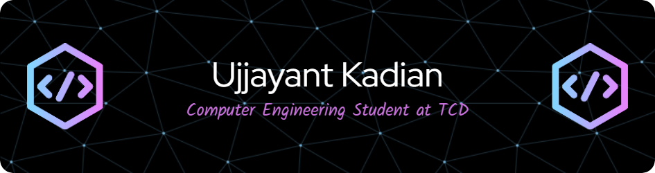

# Hi there! 👋

I'm Ujjayant Kadian, a final-year student at Trinity College Dublin and currently interning at Intel Client AI Movidius in the Compiler Team. I have a keen interest in diving into deep learning and exploring its applications.

## 🚀 About Me

- 💼 Intern at Intel Client AI Movidius, Compiler Team.
- 🎓 4th Year Student at Trinity College Dublin.
- 🌱 Currently exploring advanced concepts in deep learning.
- 💻 Proficient in JavaScript, HTML, CSS, NodeJS-ExpressJS, MongoDB, SQL, Python, C, C++.
- 🚀 Expert in full-stack web development with experience in creating interactive websites.
- 🤖 Experienced in data structures in C, implementing algorithms, especially in the realm of deep learning.
- 🧠 Familiar with deep learning concepts such as Linear Regression, Logistic Regression, FeedForward Neural Networks, and Convolutional Neural Networks.
- 🌐 Completed a Bioimaging Project with a focus on tumour segmentation and classification.
- 💡 Knowledgeable in Digital System Design with Verilog.

## 🔧 Technologies & Tools

### Languages

### Web Development

<!-- Add more as needed -->

### Frontend

<!-- Add more as needed -->

## 🌐 Projects

- [Interactive Website 1](Link to Project 1): Brief description or tagline.
- [Interactive Website 2](Link to Project 2): Brief description or tagline.
- [Deep Learning Algorithm Implementation](Link to Project 3): Brief description or tagline.
- [Bioimaging Project - Tumor Segmentation & Classification](Link to Project 4): Brief description or tagline.
<!-- Add more as needed -->

## 📈 GitHub Stats

## 📫 Let's Connect

- LinkedIn: [Ujjayant Kadian](https://www.linkedin.com/in/ujjayantkadian/)

Feel free to reach out! 😊

<!-- Optional: Add a quote or fun fact -->
> "Programming is not about typing. It's about thinking." - Rich Hickey
