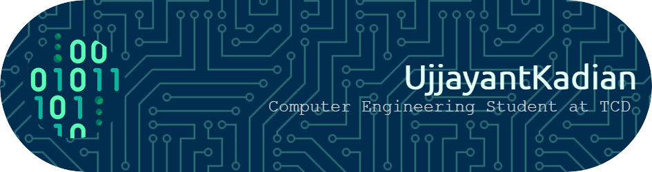

# Hi there! 👋

I'm Ujjayant Kadian, a final-year student at Trinity College Dublin and currently interning at Intel Client AI Movidius in the Compiler Team. I have a keen interest in diving into deep learning and exploring its applications.

## 🚀 About Me

- 💼 Intern at Intel Client AI Movidius, Compiler Team.
- 🎓 4th Year Student at Trinity College Dublin.
- 🌱 Currently exploring advanced concepts in deep learning.
- 💻 Proficient in JavaScript, HTML, CSS, NodeJS-ExpressJS, MongoDB, SQL, Python, C, C++.
- 🚀 Expert in full-stack web development with experience in creating interactive websites.
- 🤖 Experienced in data structures in C and implementing algorithms in it.
- 🧠 Familiar with deep learning concepts such as Linear Regression, Logistic Regression, FeedForward Neural Networks, and Convolutional Neural Networks.
- 🌐 Completed a Bioimaging Project with a focus on tumour segmentation and classification.
- 💡 Knowledgeable in Digital System Design with Verilog.

## 🔧 Technologies & Tools

### Languages

### Web Development

<!-- Add more as needed -->

### Frontend

<!-- Add more as needed -->

## 🌐 Projects

- [TechStackTracker](https://github.com/ujjayant-kadian/TechStackTracker): TechStack Tracker is a MySQL-based application designed to help users manage and track technologies, projects, dependencies, and updates within their software development environment.
- [Weather App](https://github.com/ujjayant-kadian/weather-app): Weather App is a web application that provides weather information and packing suggestions (by taking weather and air pollution into consideration) based on the location you specify or your current location.
- [P2P File Sharing Application](https://github.com/daireon008/p2cn): Designed a peer-to-peer network responsible for file-sharing between the nodes.
- [Implementation of Hash Tables](https://github.com/ujjayant-kadian/implementation-of-hash-table-using-csv-file): Implemented a hash table to store the last names of the people involved with the 1641 Irish Rebellion.
- [Database using BST](https://github.com/ujjayant-kadian/database-using-bst): Developed a faster method of implementing databases using binary search trees.
- [Dijkstra's Algorithm on Graphs](https://github.com/ujjayant-kadian/searching-with-graphs): Printed the optimal path (bus stops) between source and destination in Dublin City.
- [Bioimaging Project - Tumor Segmentation & Classification](https://github.com/ujjayant-kadian/deep-learning-projects/tree/main/lab-06): Trained two neural networks for Classification and Segmentation.
- [Quote Generator](https://github.com/ujjayant-kadian/project-1-quote-generator): Developed a website that generates different quotes on request. It allows you to tweet the exact quote by opening Twitter on a new tab.
- [Guess My Number](https://github.com/ujjayant-kadian/guess-my-number): It is a simple website/game in which the user has to guess the random number generated.
- [Pig Game](https://github.com/ujjayant-kadian/pig-game): It is a simple website that allows two people to play the pig dice game. Read about it [here](https://www.mathsweek.ie/2021/games/pig.html).
- [Infinite Scroll](https://github.com/ujjayant-kadian/project-2-infinite-scroll): Created a website that constantly fetches images from UNSPLASH API and displays them on the webpage. It allows users to scroll indefinitely, showing different images at each scroll, like social media applications.
- [Joke Teller](https://github.com/ujjayant-kadian/project-3-joke-teller): Created a website that speaks out jokes similarly to voice assistants.
- [Tic-Tac-Toe](https://github.com/ujjayant-kadian/tic-tac-toe): Made Tic, Tac, Toe game with HTML, CSS and Javascript.
- [Sequnece Detector](https://github.com/ujjayant-kadian/Sequence-Detector): Designed a system that compromises a Linear Feedback Shift Register (LFSR), a sequence detecting Finite State Machine (FSM) and a counter to count the number of times a particular codeword is issued in the stream of bits generated by the LFSR in a complete cycle of that LFSR.
- [Shell C Linux](https://github.com/ujjayant-kadian/shell-c-linux): A program that simulates the behaviour of a simple bash shell.
- [Career Guidance](https://github.com/ujjayant-kadian/career-guidance-sql): Worked with a team of 4 students to design a database that will help a user see all the career options available for their choice of stream. This database will also store details of the courses required for any chosen stream. This database will act as a career map for the users.

<!-- Add more as needed -->

## 📈 GitHub Stats

## 📫 Let's Connect

- LinkedIn: [Ujjayant Kadian](https://www.linkedin.com/in/ujjayantkadian/)

Feel free to reach out! 😊

<!-- Optional: Add a quote or fun fact -->
> "Programming is not about typing. It's about thinking." - Rich Hickey.
